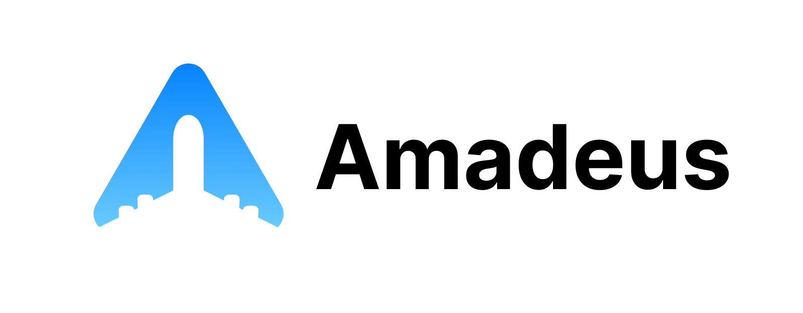

# Amadeus



### Description
Amadeus is my second Breakable Toy in the Spark Program @ Encora. It is flight search web app built with Spring boot and Java in the backend and React + TypeScript + Tailwind CSS in the frontend. It uses the Amadeus API to retrieve data about flights.

### Technologies

**Frontend**
- React JS
- TypeScript
- Vite
- Tailwind

**Backend**
- Spring Boot
- Java
- Gradle

## How to run

1. Download the project in your workspace.
2. Open a terminal and enter the backend folder with the following command:
```
cd Amadeus/backend/
```
4. Run the project with Maven.
Make sure to have installed Maven.
```
./gradlew bootRun
```
5. Once the backend is running, open another terminal and enter into the frontend folder:
```
cd Amadeus/frontend/
```
7. Run the project with npm.
Make sure to have installed npm.
```
npm run start
```
9. Open the web app.
The frontend is running on the following address:
```
http://localhost:8080/
```
11. Enjoy the app. 🎉 

### Using docker 

You can use 
```
docker-compose up --build
```
To run the project